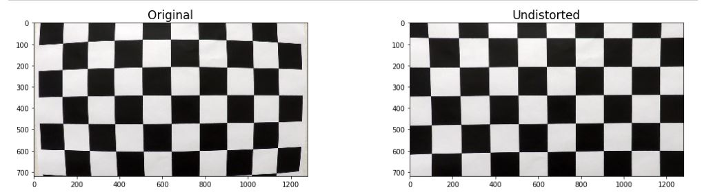
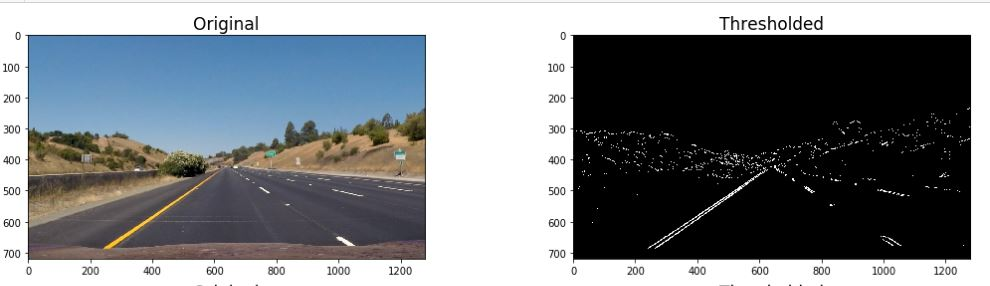
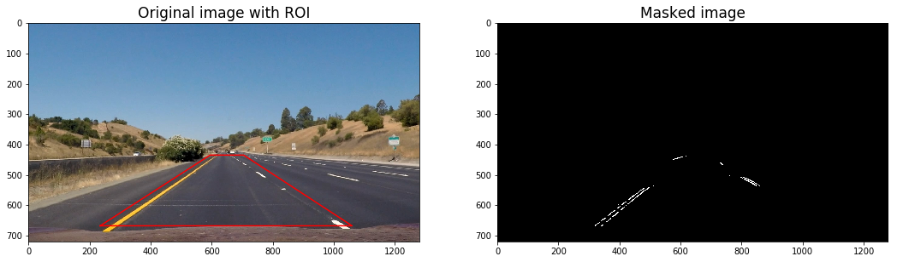
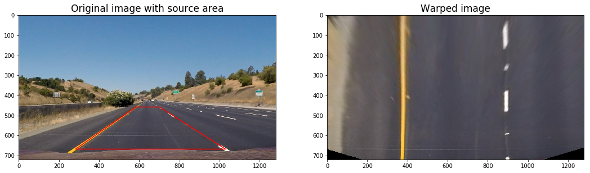

## Udacity SDC Term 1, Project 4


### Advanced Lane Finding Project ###
---

### Writeup / README

#### 1. Provide a Writeup / README that includes all the rubric points and how you addressed each one.

*This* file is the Write Up.
The IPython Notebook is [here!](./P4.ipynb)

### Camera Calibration

#### 1. Briefly state how you computed the camera matrix and distortion coefficients. Provide an example of a distortion corrected calibration image.

The helper function **calibrate_camera()** is at `Cell 04`.
Here, the image points are obtained using cv2's *findChessboardCorners()* method. The object points are defined using an mgrid.
```python
    for img in chess_images:
        gray = cv2.cvtColor(img, cv2.COLOR_RGB2GRAY)
        ret, corners = cv2.findChessboardCorners(gray, (cols, rows))
        
        if(ret):
            # Append points and actual co-ordinates
            objpoints.append(objpoints_base)
            imgpoints.append(corners)
```
Finally, cv2's *calibrateCamera()* method is called to obtain the camera matrix and distortion coefficients.
```python
ret, mtx, dist, rvecs, tvecs = cv2.calibrateCamera(objpoints, imgpoints, gray.shape[::-1], None, None)
```


The actual call to calibrate the cameara is at `Cell 13`.
```python
rows, cols = 6, 9
mtx, dist = calibrate_camera(chess_images, rows, cols)
```
### Pipeline (single images)

#### 1. Provide an example of a distortion-corrected image.

The method to undistort one or more images is at `Cell 05`.
Below is an example of a chessboard image, before and after undistortion. The same can be seen at `Cell 14`.


#### 2. Describe how (and identify where in your code) you used color transforms, gradients or other methods to create a thresholded binary image.  Provide an example of a binary image result.

The method to apply color thresholds is at `Cell 08`.
Here, the filter is set on the S Channel with a value range of **80 - 255**
Below is an example of an image with the color thresholds applied.


---

The method to apply gradient thresholds is at `Cell 09`.
I have used **x gradient** with a range of **25 - 255** and a **direction** threshold with a range between **45° - 80°**.
Below is an example of an image with the gradient thresholds applied.


---

The method to apply a region mask is at [Cell 07](P4.ipynb#3.-Region-of-Interest).
The below example clearly marks the masked region and also shows a binary image on which the mask is applied. 


#### 3. Describe how (and identify where in your code) you performed a perspective transform and provide an example of a transformed image.

The helper method which warps images is at `Cell 06`.
It uses cv2's *warpPerspective()* method to warp the perspective.

The call to this method with src and destination points is at `Cell 15`.

| Source        | Destination   | 
|:-------------:|:-------------:| 
| 584, 458      | 375, 0       | 
| 701, 458    | 900, 0   |
| 1030, 668   | 900, 720     |
| 283, 668     | 375, 720      |

I verified that my perspective transform was working as expected by drawing the `src` and `dst` points onto a test image and its warped counterpart to verify that the lines appear parallel in the warped image.



#### 4. Describe how (and identify where in your code) you identified lane-line pixels and fit their positions with a polynomial?

Then I did some other stuff and fit my lane lines with a 2nd order polynomial kinda like this:

![alt text][image5]

#### 5. Describe how (and identify where in your code) you calculated the radius of curvature of the lane and the position of the vehicle with respect to center.

I did this in lines # through # in my code in `my_other_file.py`

#### 6. Provide an example image of your result plotted back down onto the road such that the lane area is identified clearly.

I implemented this step in lines # through # in my code in `yet_another_file.py` in the function `map_lane()`.  Here is an example of my result on a test image:

![alt text][image6]

---

### Pipeline (video)

#### 1. Provide a link to your final video output.  Your pipeline should perform reasonably well on the entire project video (wobbly lines are ok but no catastrophic failures that would cause the car to drive off the road!).

Here's a [link to my video result](./project_video.mp4)

---

### Discussion

#### 1. Briefly discuss any problems / issues you faced in your implementation of this project.  Where will your pipeline likely fail?  What could you do to make it more robust?

Here I'll talk about the approach I took, what techniques I used, what worked and why, where the pipeline might fail and how I might improve it if I were going to pursue this project further.  
