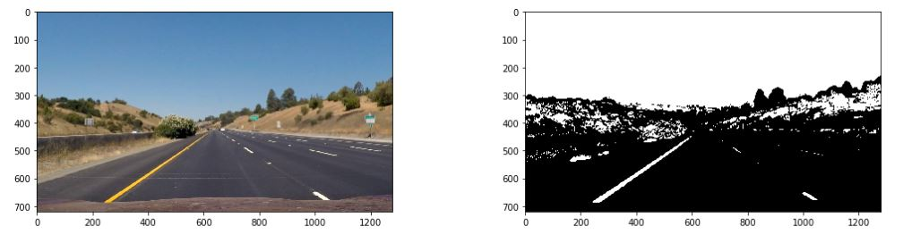

## Udacity SDC Term 1, Project 4


### Advanced Lane Finding Project ###
---

### Writeup / README

#### 1. Provide a Writeup / README that includes all the rubric points and how you addressed each one.

*This* file is the Write Up.
The IPython Notebook is [here!](./P4.ipynb)

### Camera Calibration

#### 1. Briefly state how you computed the camera matrix and distortion coefficients. Provide an example of a distortion corrected calibration image.

The helper function **calibrate_camera()** is at `Cell 04`.
Here, the image points are obtained using cv2's *findChessboardCorners()* method. The object points are defined using an mgrid.

```python
    for img in chess_images:
        gray = cv2.cvtColor(img, cv2.COLOR_RGB2GRAY)
        ret, corners = cv2.findChessboardCorners(gray, (cols, rows))
        
        if(ret):
            # Append points and actual co-ordinates
            objpoints.append(objpoints_base)
            imgpoints.append(corners)
```

Finally, cv2's *calibrateCamera()* method is called to obtain the camera matrix and distortion coefficients.

```python
ret, mtx, dist, rvecs, tvecs = cv2.calibrateCamera(objpoints, imgpoints, gray.shape[::-1], None, None)
```

The actual call to calibrate the cameara is at `Cell 13`.

```python
rows, cols = 6, 9
mtx, dist = calibrate_camera(chess_images, rows, cols)
```

### Pipeline (single images)

#### 1. Provide an example of a distortion-corrected image.

The method to undistort one or more images is at `Cell 05`.
Below is an example of a chessboard image, before and after undistortion. The same can be seen at `Cell 14`.


#### 2. Describe how (and identify where in your code) you used color transforms, gradients or other methods to create a thresholded binary image.  Provide an example of a binary image result.

The method to apply color thresholds is at `Cell 08`.
Here, the filter is set on the S Channel with a value range of **80 - 255**
Below is an example of an image with the color thresholds applied.


---

The method to apply gradient thresholds is at `Cell 09`.
I have used **x gradient** with a range of **25 - 255** and a **direction** threshold with a range between **45° - 80°**.
Below is an example of an image with the gradient thresholds applied.


---

The method to apply a region mask is at `Cell 07`.
The below example clearly marks the masked region and also shows a binary image on which the mask is applied. 


#### 3. Describe how (and identify where in your code) you performed a perspective transform and provide an example of a transformed image.

The helper method which warps images is at `Cell 06`.
It uses cv2's *warpPerspective()* method to warp the perspective.

The call to this method with src and destination points is at `Cell 15`.

| Source        | Destination   | 
|:-------------:|:-------------:| 
| 584, 458      | 375, 0       | 
| 701, 458    | 900, 0   |
| 1030, 668   | 900, 720     |
| 283, 668     | 375, 720      |

Below image displays the output of the **warp_images()** method.


#### 4. Describe how (and identify where in your code) you identified lane-line pixels and fit their positions with a polynomial?

Here I will attempt to exaplain all the parts involved with lane line detection.

1. The Lane Class defined at `Cell 10`
   - Keeps track of last n polyfits using a queue
   - Returns the mean of the last n polyfits
   - Keeps track of number of frames for which new lane lines were undetected
   - Calculates and stores the current radius of curvature
 2. The **reset_lane_lines()** method at `Cell 20`
     - Initializes new objects of Lane class for the left and right lanes
     - Uses a sliding window approach to find new lane lines on the current frame without any prior assumptions
     - Contains a *visualize* flag to display images
3. The **continue_lane_lines()** method at `Cell 21`
   - This method takes as input a polyfit for each of the two lanes
   - Uses a more targetted search along the existing polyfit lines
4. The **get_lane_lines()** method at `Cell 22`
   - This method is ultimately responsible for returning the correct polyfits to the main **pipeline()**
   - It uses the Lane class and the two methods listed above to manage the lane lines
   - First, it will attempt to use **continue_lane_lines()** (other than on first run) to do a targetted search. If this does not return any lane lines consecutively for a certain number of frames, it will use **reset_lane_lines()** to re-initialize the search. Till that time, it will return the mean of the previous polyfits.
   
Below is a visualization of the sliding window generated by the **reset_lane_lines()** method.


#### 5. Describe how (and identify where in your code) you calculated the radius of curvature of the lane and the position of the vehicle with respect to center.

The radius of curvature is calculated by method **calculate_curvature()** of the Lane class at `Cell 10, Line 44`. It is called every frame by **continue_lane_lines()**.

This is done as per the Udacity classroom code. The result is converted from pixels to meters and stored.

The main **pipeline()** method at at `Cell 23` will calculate and display the mean of the left and right curvatures at `Line 48`.

```python
mean_curv = round((left_lane.get_curvature() + right_lane.get_curvature())/2, 2)
font = cv2.FONT_HERSHEY_PLAIN
cv2.putText(result, "Radius of Curvatue : " + str(mean_curv) +  " m.",(30,50), font, 3, (0,0,255), thickness=4)
```

#### 6. Provide an example image of your result plotted back down onto the road such that the lane area is identified clearly.

I have used the Udacity classroom code to project the lane area back on to the original image. This is handled by the main **pipeline()** method at `Cell 23, Line 28`.

---

The below image is generated using the *visualize* flag of the **pipeline()** method and shows all the intermediate steps and the final result.


### Pipeline (video)

#### 1. Provide a link to your final video output.

The output of the main project video is [here](test_videos_output/project_video_output.mp4).

The model performs reasonably well on the main video, especially areas with shadows and brightness but in some cases, the projected lane area is slightly smaller than the actual one.

---

The output of the challenge video is [here](test_videos_output/challenge_video_output.mp4)

The model gets me about halfway through the challenge video. At some points, the projected lane area is significantly outside the lane boundaries. Including it here for your review.

### Discussion

#### 1. Briefly discuss any problems / issues you faced in your implementation of this project.  Where will your pipeline likely fail?  What could you do to make it more robust?

* One of the most challenging aspects of this project was determining the optimum thresholds. The current thresholds provide a mediocre perforamce with a lot of room for improvement. 

* I was not able to derive any advantage from using the gradient magnitude. A better balance of thresholds might help there.

* Since my model creates lane lines using only the mean of the past n frames, if there is a very sharp curve (especially one where not many pixels were detected), the inertia of the previous polyfits will result in an incorrect lane area.

* One area of improvement would be exploring other channels, which I did not experiment with for this project.
